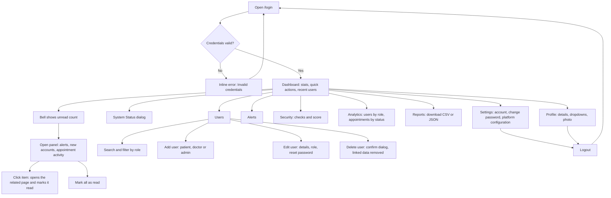

# Admin Dashboard: User Journey

How a Medisynix administrator moves through the admin area, what they see at each step, and how each step was verified.

## Persona

**Mohsin, platform administrator.** Owns the platform's accounts and health. Signs in a few times a day to check for problems, onboard doctors, help users who are locked out and export numbers for the team. Wants to know what needs attention in seconds, and to be stopped before doing something destructive.

| | |
|---|---|
| **Goals** | See platform health at a glance. Manage accounts safely. Keep their own account secure. Export reports. |
| **Frustrations to avoid** | Silent failures, dead links, unclear errors, accidental deletes. |
| **Devices** | Mostly desktop; occasionally a phone to check alerts. |

## Journey map

## Stage by stage

### 1. Sign in
- **Route:** `/login`, user type set to Admin.
- **Sees:** the sign-in form. A wrong password shows "Invalid credentials" and keeps them on the page.
- **Outcome:** redirected to `/dashboard/admin`. Opening any `/dashboard/*` URL while signed out redirects to `/login`. Patients and doctors who open an admin URL are sent to their own dashboard, and every admin API returns 401 or 403 for them.

### 2. Orient on the dashboard
- **Route:** `/dashboard/admin`.
- **Sees:** a welcome header, four stat cards (users, doctors, patients, consultations), quick actions, and a tabbed panel (Recent Users, System Alerts, Reports).
- **Decisions:** anything red in the alerts tab or the bell needs attention first.
- **Extras:** the **System Status** button opens a dialog with database mode, environment, uptime and totals.

### 3. Check notifications
- **Where:** the bell in the top bar, on every dashboard page.
- **Sees:** an unread badge (9+ when many) and a panel listing, newest first: system problems, new accounts and appointment bookings or cancellations from the last 7 days.
- **Actions:** click an item to open the related page and mark it read; "Mark all as read"; Escape or an outside click closes the panel. Read state is remembered per browser.
- **Mobile:** the panel spans the screen width under the top bar.

### 4. Manage users
- **Route:** `/dashboard/admin/users`.
- **Find:** search by name or email (case-insensitive, punctuation treated literally) and filter by role. The count updates live, and an empty state explains when nothing matches.
- **Add:** one form for all roles. Doctors get extra fields (specialty, experience, education). Weak passwords and duplicate emails are rejected with a clear message. New doctors appear immediately in Find a Doctor.
- **Edit:** `/dashboard/admin/users/:id` to change details, promote or demote, or set a new password. An admin cannot change their own role.
- **Delete:** a confirmation dialog first. Deleting removes the account **and** its appointments, health metrics, records and medications; bookings with a deleted doctor are cancelled. An admin cannot delete themselves or the last administrator.

### 5. Review platform health
- **Alerts** (`/alerts`): problems found by the latest health check, with severity.
- **Security** (`/security`): four checks and a score (JWT secret, default admin password, database, number of admins).
- **Analytics** (`/analytics`): totals, users by role, appointments by status with percentages.
- All three have a Refresh button.

### 6. Export reports
- **Route:** `/dashboard/admin/reports`.
- **Actions:** "User Activity Report" downloads a CSV (one row per account); "System Health Report" downloads a JSON snapshot. Spreadsheet formula characters in names are neutralised in the CSV.

### 7. Look after their own account
- **Settings** (`/settings`): read-only account details, **Change password** (current password required, live rule checklist, confirmation must match) and read-only platform configuration.
- **Profile** (`/profile`): edit name, phone, role, department and permissions from dropdowns; add, change or remove a profile photo. Email and join date are read-only. The header shows the saved name and photo.

### 8. Sign out
- The sidebar's Logout clears the session and returns to `/login`.

## Navigation

Sidebar: Dashboard, Users, Reports, Analytics, Alerts, Security, Settings. Profile is reached from the avatar in the top bar. The sidebar collapses to icons on desktop (remembered between visits) and becomes a drawer on phones. The top bar always names the current page.

## Edge cases covered

| Situation | Behaviour |
|---|---|
| Wrong password at sign-in | Inline error, stays on the login page |
| Expired or forged token | 401 from every admin API |
| Doctor or patient calls an admin API | 403 |
| Delete yourself, demote yourself, delete or demote the last admin | Blocked with an explanation |
| Duplicate email on create or edit | 409 with "Email already registered" |
| Invalid dropdown value, phone, image type or oversized photo | 400, nothing saved |
| Deleted user's data | Removed, so statistics stay accurate |
| Database unavailable | The platform keeps working on the local file store and an alert says so |
| No results for a search | Empty state with guidance |

## Verification summary

Run against the live app with seeded dummy data (`node scripts/seed-demo-data.mjs`: 13 users, 12 appointments, 8 records, 8 medications).

- Consistency between the user list, dashboard stats and system status: counts, role totals and consultations all agree.
- Search and filter: name, email domain, role, combined, no match, regex characters.
- Notifications: types, ordering, unique ids, unread badge, mark read, mark all, Escape, persistence.
- Role guards: every admin endpoint returns 403 for a doctor token; garbage and tampered tokens return 401.
- Admin actions: promote a patient to doctor (appears in the doctor directory), reset a user's password (old one stops working), delete a user with data.
- Browser journey: sign in (fail then succeed), dashboard, System Status, create, validation, duplicate, search, empty state, edit, delete, reports download, analytics, security, mobile layout, logout, direct URL while signed out.
- Earlier suites (patient flows, change password, profile) re-run after this round: all pass.

## Known limitations

- The default admin password (`admin123`) is still in the seed data; the Security page and a notification flag it until it is changed.
- Notification read state is stored in the browser, so it is per device.
- The notification list shows the 30 most recent items.
- The profile photo is loaded when the profile page is opened, so after signing in again the top bar shows initials until then.
- MongoDB code paths could not be run (no database in the test environment); the file-store paths were tested.
