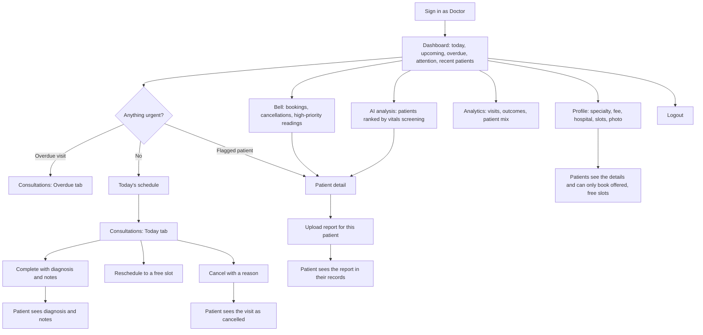

# Doctor Dashboard: User Journey

How a Medisynix doctor moves through their workspace, what they see at each step, how their actions reach patients, and how each step was verified.

## Persona

**Dr. Sarah Johnson, cardiologist.** Sees patients through Medisynix alongside a hospital clinic. She opens the dashboard before her first visit, again between consultations, and once more at the end of the day to close things off.

| | |
|---|---|
| **Goals** | Know today's schedule at a glance. Spot patients whose readings need attention. Record each consultation quickly. Get reports to patients. Keep what patients see (fee, hours, bio) accurate. |
| **Frustrations to avoid** | Fake or stale data, dead links, double-booked slots, losing notes, having to guess who is urgent. |
| **Devices** | Desktop at the clinic; a phone between visits. |

## Journey map

## Stage by stage

### 1. Sign in
- **Route:** `/login`, user type set to Doctor. Signed-out visits to any `/dashboard/*` URL redirect to `/login`; patients and admins who open a doctor URL are sent to their own dashboard.
- **Outcome:** the doctor dashboard at `/dashboard/doctor`.

### 2. Start the day: dashboard
- **Sees:** a greeting, five live counters (patients, today, upcoming, completed this month, need attention), today's schedule sorted by time, the next visits, the patients who need attention, and recent patients.
- **Overdue banner:** if past visits are still open, an amber banner names them and links to the Overdue tab so nothing slips through.
- **Empty states:** every panel explains itself when there is nothing to show (for a brand-new doctor there are no invented patients).

### 3. Triage
- **Bell** (every page): unread badge and a panel with new bookings, cancellations and high-priority readings from the last 7 days. Clicking an item opens the related page and marks it read.
- **AI analysis** (`/ai-analysis`): every patient screened against recorded vitals (blood pressure, heart rate, glucose, BMI) and ranked High priority, Needs review, Monitor, No concerns or No vitals. Priority tiles filter the list; each patient expands to show the reading that triggered the flag and a consideration for review. A banner states plainly that this is rule-based screening, not a diagnosis, and that it only knows what patients have entered.

### 4. Run the day: consultations
- **Route:** `/consultations`, tabs Today, Upcoming, Overdue, Completed and Cancelled, each with a count, plus search by patient or reason. Deep links (`?tab=overdue`, `?search=Name`) come from the dashboard and patient pages.
- **Complete:** a dialog for diagnosis and notes. Only visits dated today or earlier can be completed. The patient sees the diagnosis and notes under their Consultations.
- **Reschedule:** pick a date and one of the allowed time slots; the app refuses a slot that already holds another visit.
- **Cancel:** optional reason; the visit moves to Cancelled and the patient sees it cancelled.
- **Edit notes:** completed visits keep their diagnosis and notes editable.
- **Rules:** cancelled visits are final; finished visits cannot be reopened or rescheduled.

### 5. Know the patient: patient detail
- **Route:** `/patients` (searchable list, filters for Needs attention and Has upcoming visit, most urgent first) then `/patients/:id`.
- **Sees:** identity and contact details, latest vitals colour-coded by severity with recent history, the screening flags with explanations, every visit with diagnosis and notes, the medical profile (conditions, allergies), medications and records.
- **Access:** a doctor can only open patients who have booked with them. Anyone else looks like "not found".

### 6. Send a report to the patient
- **Route:** `/upload-report`, or the Upload report button on a patient page (patient pre-selected).
- **Steps:** lab or imaging, the specific test from a list, title, date, findings, optional recommendations, optional PDF/PNG/JPEG attachment up to 2 MB.
- **Outcome:** the report appears in the patient's Medical Records with the doctor's name. Nothing is auto-generated: the findings are the doctor's own.

### 7. Review the practice: analytics
- **Route:** `/analytics`. Patients, appointments, completion rate, new patients this month, visits per month by outcome, appointments by status, busiest weekdays, top visit reasons, patient gender mix and the current screening spread.

### 8. Keep the public profile right
- **Route:** `/profile`. Name, phone, specialty, city (dropdowns), qualifications, experience, hospital, licence number, consultation fee, languages and available time slots (chips), bio and photo.
- **Effect on patients:** the same details appear in Find a Doctor and on the doctor's page. In the booking form, patients can only choose the slots the doctor offers, and slots already taken on that date are disabled.

### 9. Sign out
- The sidebar's Logout clears the session and returns to `/login`.

## How doctor actions reach patients

| Doctor action | What the patient sees |
|---|---|
| Completes a visit with diagnosis and notes | Consultations page: diagnosis and notes; Appointments: moves to Past |
| Cancels a visit | Appointments: Cancelled tab |
| Reschedules a visit | Appointments: new date and time |
| Uploads a report | Medical Records: the report with the doctor's name and any attached file |
| Changes fee, hospital, bio, languages or slots | Find a Doctor, doctor page and the booking form |

## Rules the system enforces

| Situation | Behaviour |
|---|---|
| Two patients book the same doctor, date and time | The second is refused (409) and told to choose another slot |
| Booking a time the doctor does not offer, or a past or impossible date | Refused (400) |
| A cancelled slot | Becomes bookable again |
| Patient reschedules onto a taken slot | Refused (409); their own current slot counts as free |
| Doctor moves a visit onto another visit | Refused (409) |
| Completing a future visit, reopening a finished one, rescheduling a completed one | Refused (400) |
| Opening, editing or uploading for another doctor's patient or appointment | Not found (404) |
| A patient or admin calling a doctor API, or no token | 403 or 401 |
| Invalid profile values (unknown specialty or city, bad phone, fee out of range, no language or no slot, unsupported image) | Refused (400), nothing saved |
| Reports: unknown test, missing title or findings, future date, wrong file type, file over 2 MB | Refused (400) |

## Verification summary

Run against the live app with seeded dummy data (`node scripts/seed-demo-data.mjs`: 13 users, doctor-heavy bookings for Dr. Sarah including today's visits, completed visits, an overdue one and cancellations, vitals from normal to a hypertensive-crisis reading, records, medications and doctor-uploaded reports).

- **Doctor API suite (140 checks):** access control for every endpoint against no token, a patient and an admin; overview counters against the underlying lists; today's visits sorted by clock time; patient search, filters and ordering; isolation between doctors; every appointment rule above; the screening thresholds at their boundaries (blood pressure, heart rate, glucose, BMI, the combined flag and unreadable input); analytics totals against the raw list; profile persistence and 16 kinds of invalid input; report uploads with and without files and 9 kinds of invalid input; notifications.
- **Booking-slot suite (29 checks):** availability, double-booking, past and impossible dates, cancellation freeing a slot, patient and doctor rescheduling, and slots following the doctor's profile.
- **Earlier suites re-run** (patient flows, admin, change password, profile): all pass.
- **Browser journey:** sign-in, dashboard, bell (badge, click-through, mark all read), patient list and detail, complete, reschedule and cancel through the dialogs, search and empty states, AI analysis, analytics, profile edit with dropdowns, chips, photo and validation, report upload with invalid files then success, and the patient booking form showing the doctor's slots.
- **Responsive:** every doctor page measured at phone (375 px) and tablet (768 px) widths with no horizontal overflow; desktop screenshots reviewed.

## Known limitations

- The screening uses only what patients have recorded and simple reference ranges; it is a prompt for review, not clinical advice.
- Doctors see the patients who have booked with them. There is no add-patient or referral flow yet.
- Notification read state is stored in the browser, so it is per device.
- Attached report files are stored with the record (2 MB limit) rather than in object storage.
- MongoDB code paths could not be run (no database in the test environment); the file-store paths were tested.
