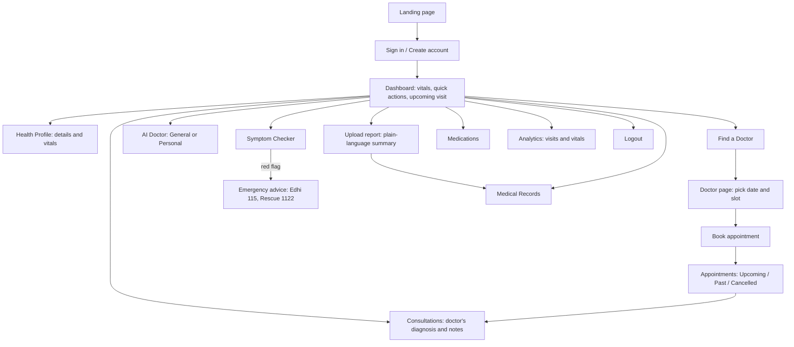

# Patient Dashboard: User Journey

How a Medisynix patient moves through the app, what they see at each step, how their actions reach doctors, and what is real versus a prototype.

## Persona

**Ayesha Khan, 38.** Has high blood pressure and a penicillin allergy. Wants quick, understandable answers about her health and an easy way to see a cardiologist.

| | |
|---|---|
| **Goals** | Understand her readings and reports. Ask health questions safely. Book and track visits. Keep her records in one place. |
| **Frustrations to avoid** | Medical jargon, fake numbers, dead links, double bookings, not knowing when to go to hospital. |
| **Devices** | Mostly a phone; sometimes a laptop. |

## Journey map

## Stage by stage

### 1. Sign in
- **Route:** `/login` (tab **Patient**), or `/register` to create an account.
- **Outcome:** `/dashboard/patient`. Opening any dashboard URL while signed out redirects to `/login`; a doctor or admin who opens a patient URL is sent to their own dashboard.
- **Rules:** wrong password or wrong role tab shows "Invalid credentials". Passwords are hashed; the signed token lasts 7 days.

### 2. Dashboard
- **Sees:** a greeting, quick actions (AI Doctor, Health Profile, Book Appointment, Insights, Upload Report, My Records, Find a Doctor), four health-metric cards with colour tags (High / Normal / Elevated / Overweight), an AI health signal, the next appointment and recent reports.
- **Decisions:** a red tag on blood pressure tells her to act (repeat the reading, see a doctor).
- **Honesty:** the cards use standard reference ranges and the "AI health signal" is a rule-based score, not a diagnosis.

### 3. Health profile
- **Route:** `/dashboard/patient/profile` then **Edit Profile**.
- **Fields:** phone, date of birth, gender, blood type, allergies, conditions, medications, height, weight, blood pressure, heart rate, glucose. BMI is calculated.
- **Validation:** height 50–260 cm, weight 2–500 kg, heart rate 20–250, glucose 20–900, blood pressure like `120/80`. Anything else is refused with a message.
- **Effect:** saving writes one history entry; the doctor sees the new readings and the screening flags update.
- **Sign-in on a new device:** saved profile details come back from the server at login, so nothing is lost when switching browsers.

### 4. Find a doctor
- **Route:** `/dashboard/patient/find-doctor`. Search by name, speciality or hospital; filter by speciality and location.
- **Sees:** fee in rupees, experience, hospital, next available date and the doctor's own time slots.

### 5. Book an appointment
- **Route:** the doctor page `/dashboard/patient/doctor/:id`, then the booking form on `/dashboard/patient/appointments`.
- **Steps:** choose date and slot (the button stays disabled until both are chosen), add a reason, book.
- **Rules:** a slot already taken is refused (409); past or invalid dates are refused (400); only the slots the doctor offers can be chosen; cancelling frees the slot.
- **Effect:** the visit appears under **Upcoming**; the doctor sees it on the dashboard and in the bell.

### 6. AI Doctor
- **Route:** `/dashboard/patient/ai-doctor`, then **General** or **Personal**.
- **General:** a real language model (Chatbase agent grounded on Aga Khan University Hospital and Al Shifa Hospital information). Gives general guidance and says when to see a doctor.
- **Personal:** the same style of assistant with her saved health summary shown next to the chat as a reminder of what to mention. The profile is not sent to the model.
- **Needs:** an internet connection.

### 7. Symptom checker
- **Route:** `/dashboard/patient/symptom-checker`.
- **How it works:** type symptoms or tap chips; the page compares them with ten common conditions and shows the percentage of each condition's typical symptoms she reported, advice, and a care level ("Usually self-care", "See a doctor soon" and so on).
- **Safety:** phrases such as chest pain, shortness of breath, severe bleeding, confusion or coughing blood show a red alert pointing to Edhi 115 and Rescue 1122. The whole phrase must be present (plain "cough" does not trigger "coughing blood").
- **Honesty:** a banner states it is not a diagnosis.

### 8. Upload a report
- **Route:** `/dashboard/patient/upload-report`.
- **Steps:** choose Medical image or Lab test, choose the specific test, attach a file, **Upload and analyze**.
- **Sees:** a plain-language explanation, a table of values with status, interpretation and recommendations, and "How Medisynix reached this reading" with a confidence score and reasoning steps.
- **Effect:** a summary is saved to **Medical Records**.
- **Prototype note:** the explanation is a sample for the selected test type; the file is not yet read by a model. The page says so.

### 9. Medical records and medications
- **Records** (`/dashboard/patient/records`): type chips with counts, search, detail window, download or open attached files, delete only her own records. Reports uploaded by doctors appear here with the doctor's name.
- **Medications** (`/dashboard/patient/medications`): today's reminders, current list, add and remove.

### 10. Visits and insights
- **Appointments:** Upcoming, Past, Cancelled; cancel an upcoming visit.
- **Consultations:** completed visits with the doctor's diagnosis and notes, plus search and Recent / Past filters.
- **Analytics:** real counts (appointments, upcoming, completed, cancelled), latest vitals, visits per month with a 1 / 3 / 12-month range, and an empty state when there is nothing to show.

### 11. Sign out
- The sidebar's **Logout** clears the session and returns to `/login`.

## How patient actions reach other roles

| Patient action | Who sees it | Where |
|---|---|---|
| Books a slot | Doctor | Dashboard (Coming up), Consultations, notification bell; slot disappears for others |
| Cancels a visit | Doctor | Consultations → Cancelled, notification |
| Updates vitals | Doctor | Patient file and AI Analysis (priority flags) |
| Adds a record or medicine | Doctor | Patient file |
| Registers | Admin | Users list, dashboard counters, notifications |

## Rules the system enforces

| Situation | Behaviour |
|---|---|
| Two patients book the same doctor, date and time | Second is refused (409) |
| Booking a past or impossible date, or an unoffered time | Refused (400) |
| Impossible vitals (weight 9000 kg, BP 999/999) | Refused (400), nothing saved |
| Reading another patient's data or records | Not found (404) |
| Calling a doctor or admin API | 403; no token or forged token: 401 |
| Weak password or duplicate e-mail at registration | Refused with a clear message |

## What is real and what is a prototype

| Feature | Status |
|---|---|
| Accounts, profile, booking, appointments, consultations, records, medications | Working, validated, stored in the database or local files |
| General / Personal AI Doctor chat | Real language model via Chatbase |
| Symptom checker, dashboard health signal | Rule-based (transparent) |
| Report explanation | Prototype: sample output for the chosen test type |
| Payments, video calls, chat with doctors | Not built |

## Known limitations

- The AI chat needs internet and depends on a third-party service.
- The symptom checker covers ten common conditions only and is English-only (no Urdu yet).
- Attachments are stored with the record (2 MB limit), not in cloud storage.
- Notification read-state is stored in the browser, so it is per device.
- Not clinically validated; information only, never a diagnosis.
